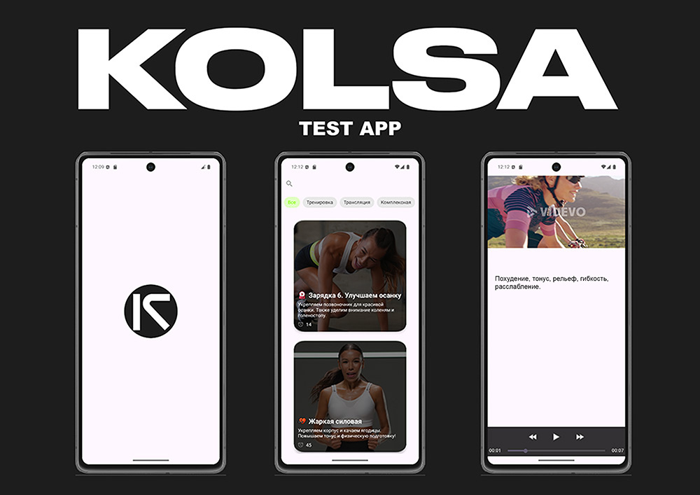
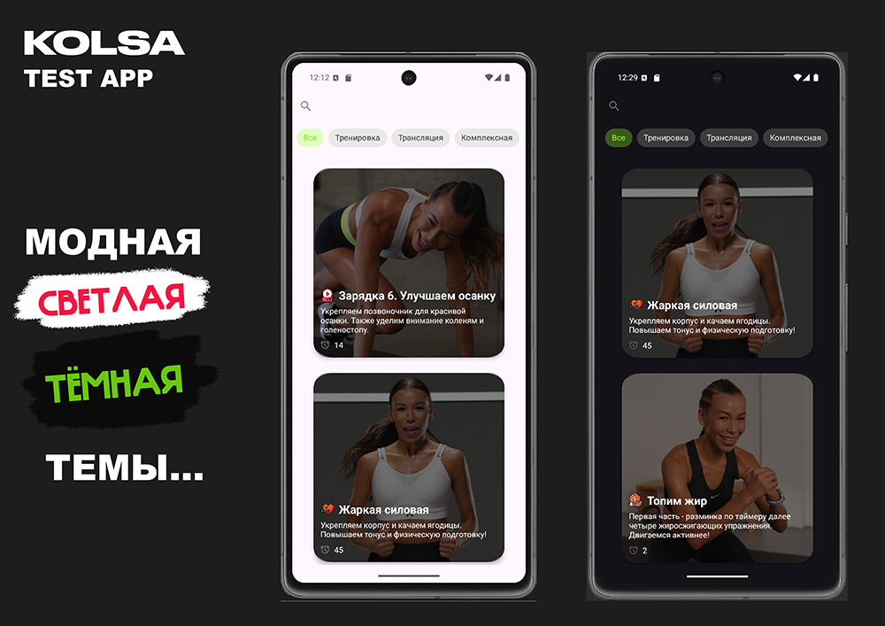

<h1 align="center">KOLSA Test App</h1>

Приложение для отображения списка тренировок с возможностью их просмотра с довольно посредственным дизайном...

## Содержание

- [Описание](#описание)
- [Стэк](#стэк)
- [Модульность](#модульность)
- [Функции](#функции)
- [Что можно улучшить](#что-можно-улучшить)

## Описание

KOLSA Test App — это минималистичное Android-приложение со списоком тренировок и просмотром видео с упражнениями по URL.

## Дизайн

В KOLSA Test App вы найдёте *шедеврально* нейтральный дизайн. 

Тем не менее, приложение поддерживает как **тёмную**, так и **светлую** тему. Потому что даже когда дизайн посредственный — он должен быть посредственным *в обоих режимах*.
> Дизайн, который ничего не обещает — и сдерживает это обещание.

## Стэк

- Язык: Kotlin
- UI: View-based (XML), без Compose
- Архитектура: MVVM
- Сетевая работа: Retrofit / OkHttp
- Отображение списка: RecyclerView
- Воспроизведение видео: MediaPlayer
- Обработка состояний: loading / error / empty

## Модульность

- **app** — модуль «сборки» и запуска приложения
- **feature-list** — фича отображения списка тренировок
- **feature-player** — фича экрана деталей тренировки и видеоплеера

`app` зависит от двух фич-модулей, фичи не перекрёстно зависят друг от друга.

## Функции

1. **Экран 1: Список тренировок**
    - Отображает список доступных тренировок с полями:
        - Название
        - Тип (Кардио, Силовые, Растяжка и др.)
        - Длительность (в минутах)
        - Краткое описание
    - Обязательные функции:
        - Поиск по названию тренировки
        - Фильтрация по типу (одновременный выбор только одного типа)

2. **Экран 2: Детали и видеоплеер**
    - Подробная информация о тренировке
    - Встроенный MediaPlayer для воспроизведения видео по URL
    - Состояния загрузки, ошибки и пустого контента

3. **Работа с API**
    - Импорт Swagger YAML в Swagger Editor
    - Генерация моделей и эндпоинтов для получения списка тренировок

## Что можно улучшить

- Было бы здорово мигрировать на Jetpack Compose — пусть разработчики приободрятся!
- Настроить внятный DI (Dagger или Hilt) вместо «новые объекты прямо в каждом ViewModel»
- Подправить интерфейс — даже цветовая палитра заслуживает лучшей участи
- Доработать экран воспроизведения: добавить прогресс-бар, буферизацию и анимацию
- Написать кастомный Player с приятным дизайном и плавными контролами 